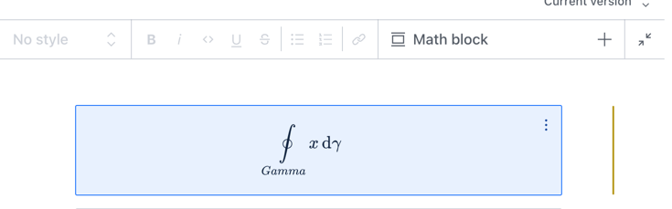

# LaTeX input for Sanity

> For the v2 version, please refer to the [v2-branch](https://github.com/sanity-io/latex-input/tree/studio-v2).

## What is it?

sanity-plugin-latex-input adds support for `latex` schema type, so it can be used in Portable Text Editor (PTE) in Sanity Studio.



## Installation

```sh
npm install --save sanity-plugin-latex-input
```

or

```sh
yarn add sanity-plugin-latex-input
```

## Usage


Import and add the plugin to your studio config in sanity.config.ts (or .js):

```ts
import { latexInput } from "sanity-plugin-latex-input";

export default defineConfig({
  /* ... */

  plugins: [
      latexInput()
  ]
})
```

You may now use the type name `latex` in your schema, such as in portable text.

## Example schema definition for portable text

```
import React from 'react'
const mathInlineIcon = () => (
  <span>
    <span style={{ fontWeight: 'bold' }}>∑</span>b
  </span>
)
const mathIcon = () => <span style={{ fontWeight: 'bold' }}>∑</span>

export default {
  name: 'portableTextWithLatex',
  type: 'array',
  title: 'Body',
  of: [
    {
      type: 'block',
      title: 'Block',
      of: [
        { type: 'latex', icon: mathInlineIcon, title: 'Inline math' },
      ],
    },
    { type: 'latex', icon: mathIcon, title: 'Math block' },
  ],
}
```

The Portable Text editor will render a preview of the contents with KaTeX.

## License

MIT-licensed. See LICENSE.

## Develop & test

This plugin uses [@sanity/plugin-kit](https://github.com/sanity-io/plugin-kit)
with default configuration for build & watch scripts.

See [Testing a plugin in Sanity Studio](https://github.com/sanity-io/plugin-kit#testing-a-plugin-in-sanity-studio)
on how to run this plugin with hotreload in the studio.

### Release new version

Run ["CI & Release" workflow](https://github.com/sanity-io/latex-input/actions/workflows/main.yml).
Make sure to select the v3 branch and check "Release new version".

Semantic release will only release on configured branches, so it is safe to run release on any branch.
